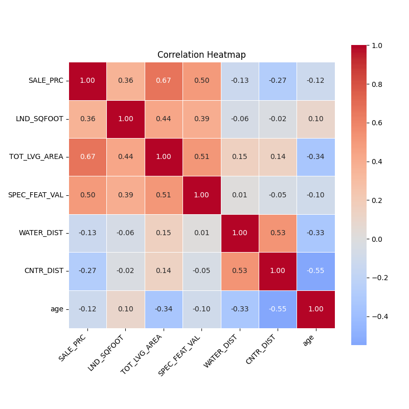
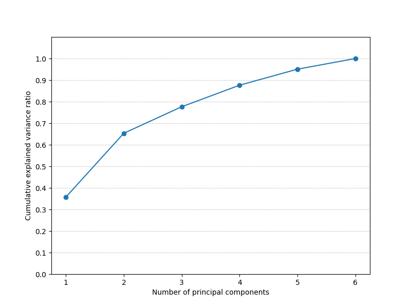

# Miami Housing PCA Analysis

## Overview
This project employs Principal Component Analysis (PCA) to find the key factors affecting property prices within the Miami housing market. PCA serves as a powerful dimensionality-reduction technique that reduces the complexity of high-dimensional data. It achieves this by transforming the data into a set of linearly uncorrelated variables known as principal components. These components are ordered so that the first few retain most of the variation present in all of the original variables. The overarching goal is not just to reduce the dimensionality but also to identify the most significant features that impact property prices. By focusing on the principal components with the highest variance, we can infer which attributes are the most influential, offering a nuanced understanding of the dynamics at play in the valuation of real estate.

## Installation & Usage
To set up the project environment, follow these steps:
1. Clone this repository.
2. Install the dependencies with `pip install -r requirements.txt`.
3. Run the analysis using `python miami_housing_pca.py`

## Data Preprocessing
The dataset contains various features of the Miami housing market, including property identifiers, sale prices, areas, and distances from significant locations. Our analysis focuses on the following columns: SALE_PRC, LND_SQFOOT, TOT_LVG_AREA, SPEC_FEAT_VAL, WATER_DIST, CNTR_DIST, and age. We have preprocessed the data by selecting these columns, scaling them, and then fitting PCA.

## Analysis
### Correlation Heatmap

The heatmap displays the Pearson correlation coefficients between variables, highlighting the relationships between different property characteristics. Notably, SALE_PRC is correlated with TOT_LVG_AREA and SPEC_FEAT_VAL, suggesting these features may influence the sale price significantly.

### Cumulative Variance Plot

This plot shows the proportion of the dataset's variance captured by the principal components. It helps determine the number of components to retain for a simplified yet comprehensive representation of the original dataset.

## Results
The table below illustrates the PCA loadings for each principal component, which represent the correlation between the original variables and the principal components. These loadings help us understand the contribution of each original feature to the principal components.

| Feature        | PC1     | PC2     | PC3     | PC4     | PC5     | PC6     |
|----------------|---------|---------|---------|---------|---------|---------|
| LND_SQFOOT     | 0.217   | 0.530   | 0.532   | -0.498  | 0.101   | 0.363   |
| TOT_LVG_AREA   | 0.477   | 0.372   | -0.197  | -0.060  | -0.623  | -0.450  |
| SPEC_FEAT_VAL  | 0.313   | 0.496   | -0.193  | 0.569   | 0.544   | 0.081   |
| WATER_DIST     | 0.412   | -0.334  | 0.538   | 0.529   | -0.292  | 0.257   |
| CNTR_DIST      | 0.465   | -0.392  | 0.198   | -0.250  | 0.478   | -0.532  |
| age            | -0.492  | 0.268   | 0.558   | 0.247   | -0.813  | -0.563  |

These loadings are key to interpreting the components. For instance, `TOT_LVG_AREA` has a strong positive loading on PC1, suggesting that larger living areas significantly influence this principal component's score.